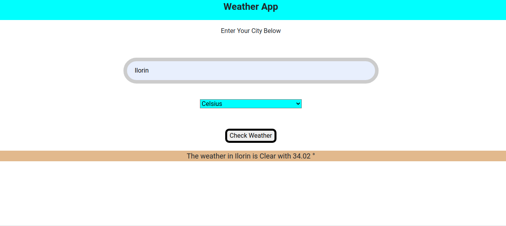

# weather

This is a weather app that is used to check the weather condition of any location, the user also has the opportunity to select Celsius or Fahrenheit.

## Built With
This project development was achieved using the following technologies:

- Html
- Javascript ES6
- Webpack
- CSS

## Live Demo

## Home Page of the Application

## Getting Started

To get a local copy up and running follow these simple example steps.

### Prerequisites
    npm

    npm install npm@latest -g

#### You should have installed git on your local machine and a text editor of your choice.
### Setup

- Forking the project-Repository
- Cloning the project to your local machine by clicking here https://github.com/haraphat01/weather
- `cd` into the project directory
- right click on the index.html file and select open with a browser

## Authors

👤 **Author**

- Github: [@haraphat01](https://github.com/haraphat01)
- Twitter: [@haraphat01](https://twitter.com/haraphat01)
- Linkedin: [Arafat Akata](https://www.linkedin.com/in/arafat-akata/)

## 🤝 Contributing

Contributions, issues and feature requests are welcome! Start by:

- Forking the project
- Cloning the project to your local machine
- `cd` into the project directory
- Run `git checkout -b your-branch-name`
- Make your contributions
- Push your branch up to your forked repository
- Open a Pull Request with a detailed description to the development branch of the original project for a review

## Show your support

Give a ⭐️ if you like this project!

Feel free to check the [issues page](issues/).

## Show your support

Give a ⭐️ if you like this project!

## Acknowledgments

- Appreciation to my coding Partner and mentor

## 📝 License

This project is [MIT](lic.url) licensed.
